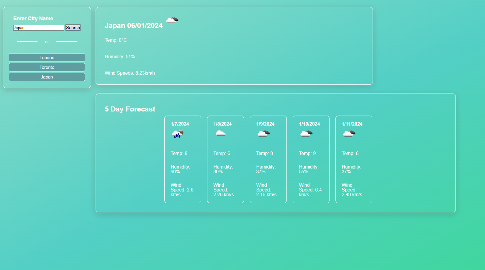

## Description

The goal of this application was to use an API call to retrieve and display weather information
of a given city. 

A user can input a city, and it will display the current date as well as the next 5 days. 

## User Story
AS A traveler
I WANT to see the weather outlook for multiple cities
SO THAT I can plan a trip accordingly

## Acceptance Criteria

GIVEN a weather dashboard with form inputs
WHEN I search for a city
THEN I am presented with current and future conditions for that city and that city is added to the search history
WHEN I view current weather conditions for that city
THEN I am presented with the city name, the date, an icon representation of weather conditions, the temperature, the humidity, and the the wind speed
WHEN I view future weather conditions for that city
THEN I am presented with a 5-day forecast that displays the date, an icon representation of weather conditions, the temperature, the wind speed, and the humidity
WHEN I click on a city in the search history
THEN I am again presented with current and future conditions for that city

## Link URL to deployed webpage on GitHub
https://rafflafressia.github.io/weather-forecast-app/

## Capture of working program

# Installation
N/A

## Technologies Used
VS Code
Github

## Credits
Institution: The University Of Toronto
Course: Bootcamp Full Stack Development
Tutor: Jose Lopez
#License
NA